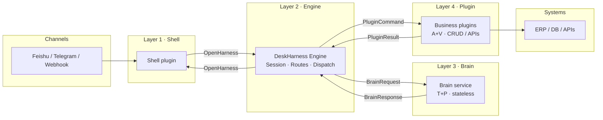

# DeskHarness ⚙️

**English** · [简体中文](./README.zh-CN.md)

[](LICENSE)
[](https://www.python.org/downloads/)
[](https://github.com/SynSwarm/OpenHarness)
[](CHANGELOG.md)

**Open-source Thin Harness Engine** — decouple **Shell**, **Engine**, **Brain**, and **plugins** with clear contracts.

> **Swap your Feishu bot without touching Brain. Swap your LLM without touching plugins.**
>
> **Decisions live in Brain. Execution lives in plugins. Evidence lives in V. Routing lives in Engine.**

---

## The problem we solve

In any AI application: who is allowed to **decide**? Who is allowed to **execute**? Where is the **evidence chain** when something fails?

Most projects slowly become monoliths — swap a channel and you rewrite Brain; swap a model and you touch plugins; when things break, no one can tell which layer failed. DeskHarness answers these questions as an **Integration Harness** — not an Agent framework, but an **integration contract layer** that does not build the "engine"; it defines standard interfaces and wiring between Shell, Brain, and plugins.

| | LangChain / CrewAI, etc. | DeskHarness |
|---|--------------------------|-------------|
| Core question | How should the LLM think and use tools? | How do we cleanly assemble thinking, tools, and channels? |
| Role | Provides engines and sensors | Defines the bus, interfaces, and wiring between them |
| Swappability | Swapping models/tools often means changing framework code | Swap models via `brain.yaml`; swap channels via Shell plugins |

**Complementary, not competitive:** run LangChain (or any stack) as your Brain service, then plug it into DeskHarness for orchestration and contracts — keep your reasoning layer, lose the framework lock-in.

**Status:** **v0.1.0 release candidate** — Phase 0–3 complete (Thin Engine production-ready). See [CHANGELOG](CHANGELOG.md) ([known limitations](CHANGELOG.md#known-limitations-v010)) and [Release checklist](doc/deployment/release.md). Phase 4 next: Feishu demo, docs site.

---

## Core value

### Architecture guardrails — no agent running wild

[OpenHarness](https://github.com/SynSwarm/OpenHarness) and `routes.yaml` enforce a hard split between **Brain (decide)**, **plugins (execute)**, and **Shell (present)**:

| Rule | Meaning |
|------|---------|
| Brain does **T+P** only | Outputs target and plan; **never** touches the database |
| Plugins do **A+V** only | Change world state and return evidence; **never** pick the next hop |
| Engine does **R** only | Routes from verification evidence; **no** business branching |
| Shell converts only | Collects intent, renders replies; **never** calls Brain or plugins directly |

In multi-channel, multi-plugin setups, these guardrails keep the system from turning into spaghetti. Full anti-pattern list and [review 5 questions](doc/architecture/architecture.md#12-评审-5-问强制) live in [`doc/architecture/architecture.md`](./doc/architecture/architecture.md).

### TPAVR fractal rules — one mental model at every scale

**T**arget · **P**lan · **A**ction · **V**erify · **R**oute is not just the shell around a Turn — it is a **fractal structure** from a plugin handler's internals, through a single command, up to a full conversation. Debug at any zoom level and you see the same skeleton. That consistency cuts cognitive load in large AI systems. See architecture [§8 TPAVR](doc/architecture/architecture.md#8-tpavrr-公理叙事脊梁).

### Shipped in v0.1.0

- **OpenHarness** invoke + **webhook-generic** Shell (`POST /shells/webhook-generic/inbound`)
- **Plugin execution**: `local-script` · `sync-http` · `async-webhook` · `in-process` — built-ins: `noop` / `echo` / `order-lookup` / `async-demo`
- **Brain adapters**: `mock` · `http` · `prompt-template` (rule-based YAML, no LLM)
- **Ops & observability**: `/metrics` · turn audit logs · `/debug/routes` · `/debug/dry-run` · optional rate limit
- **Session**: SQLite by default, optional Redis (`pip install deskharness[redis]`)
- **Deployment**: official Docker image (`ghcr.io/synswarm/deskharness`) · `docker compose` example · `deskharness plugin new` scaffold

**Planned for Phase 4:** `feishu-bot` Shell · `examples/feishu-order/` end-to-end demo · MkDocs site.

---

## Quick Start

Requires Python 3.11+.

```bash
git clone https://github.com/SynSwarm/DeskHarness.git
cd DeskHarness
pip install -e ".[dev]"

# Start Engine (falls back to configs/config.template.yaml if config.yaml is absent)
deskharness serve
```

In another terminal:

```bash
# Health check
curl -s http://127.0.0.1:8080/openharness/health

# Minimal invoke (golden fixture)
curl -s -X POST http://127.0.0.1:8080/openharness/invoke \
  -H 'Content-Type: application/json' \
  -d @schemas/openharness/fixtures/minimal-request.json

# Full turn: mock Brain → noop plugin (trigger word: trigger-noop)
curl -s -X POST http://127.0.0.1:8080/openharness/invoke \
  -H 'Content-Type: application/json' \
  -d '{"protocol_version":"1.0.0","request_id":"req_noop","request":{"context":{"session_id":"sess_noop","user_intent":"please trigger-noop"}}}'

# Webhook Shell
curl -s -X POST http://127.0.0.1:8080/shells/webhook-generic/inbound \
  -H 'Content-Type: application/json' \
  -d '{"text":"Hello from webhook","session_id":"sess_demo"}'
```

Run contract tests:

```bash
pytest tests/ -q
```

**Docker one-liner** (from repo root):

```bash
docker compose -f examples/minimal/docker-compose.yml up --build
```

**Official image** (after a release tag is published to GHCR):

```bash
docker run -d -p 8080:8080 ghcr.io/synswarm/deskharness:latest
# or: docker compose -f examples/minimal/docker-compose.image.yml up -d
```

See [`doc/deployment/docker.md`](doc/deployment/docker.md) for volumes, custom config, and maintainer publish steps.

**Scaffold a plugin:**

```bash
deskharness plugin new my-bot --type plugin
deskharness plugin new my-shell --type shell
```

Optional: copy `configs/config.template.yaml` → `configs/config.yaml` for local overrides (gitignored). For rule-based Brain without an LLM, set `brain.adapter: prompt-template` and `brain.template_file: ./configs/brain.prompt-template.yaml` — see [`examples/minimal/`](./examples/minimal/).

---

## Architecture

Four layers, strict boundaries — no cross-layer shortcuts.



| Layer | Role | Examples |
|-------|------|----------|
| **Shell** | Collect intent, render replies; channel adapters | `webhook-generic` (shipped) · `feishu-bot` (Phase 4) |
| **Engine** | OpenHarness endpoint, session, routing, plugin gateway | `app/` + `core/` |
| **Brain** | LLM / RAG reasoning; outputs Target + Plan (T+P) | External HTTP service (LangChain works here) |
| **Plugin** | Mechanical execution; Action + Verify (A+V) | `noop` · `echo` · `order-lookup` · `async-demo` |

**Rule of thumb:** Brain thinks, plugins act, Engine orchestrates. Shell only talks to Engine via [OpenHarness](https://github.com/SynSwarm/OpenHarness).

---

## Built for

| Who | What you get |
|-----|--------------|
| **Enterprise architects / tech leads** | A unified, governable AI integration base; anti-patterns and review 5 questions to prevent architectural rot |
| **Senior backend engineers** | Tired of wrestling inside frameworks? A thin core with clear boundaries and contract tests |
| **Open-source contributors** | Thin core, explicit extension points — low cost to ship a new Shell (Discord, Slack, Feishu) or Brain adapter |

---

## When to use DeskHarness

| ✅ Good fit | ❌ Not a fit |
|-------------|--------------|
| Multi-channel bots (Feishu, Telegram, webhooks) sharing one Brain | Drag-and-drop Agent builder (try Dify, Coze) |
| Teams that want to swap LLM providers without rewriting plugins | All-in-one RAG + UI platform |
| SME deployments: single process, SQLite default / Redis optional, official Docker, no K8s required | Complex multi-agent reasoning graphs |
| Headless integration into existing backends | Replacing LangChain inside your Brain layer |

---

## How it compares

DeskHarness **complements** Agent frameworks — it sits at the **integration and contract** layer.

| | DeskHarness | LangChain / CrewAI | Dify / FastGPT | n8n |
|---|-------------|-------------------|----------------|-----|
| **Core question** | Who does what, with what contract? | How does the LLM think and call tools? | How do users build Agents in a UI? | How do I wire automations? |
| **Analogy** | Integration bus / contract layer | Engine and sensors | Full assembly line | Workflow orchestration |
| **Brain / LLM** | External HTTP service | Built-in chains & agents | Built-in model routing | Not the focus |
| **Channels** | Pluggable Shell plugins | Bring your own | Built-in apps | Connectors |
| **Business logic** | Plugin layer (A+V) | Tools / custom code | Workflow nodes | Workflow nodes |
| **Session truth** | Engine owns `session_id` | Varies by framework | Platform-managed | Per-workflow |
| **Deployment** | Single process; SQLite / optional Redis; official Docker | Library / varied | Managed or self-host | Self-host SaaS |
| **UI** | Headless (no UI) | None / optional | Full console | Visual editor |

Agent frameworks answer *"how should the LLM reason?"*  
DeskHarness answers *"who owns state, how do layers talk, where is the failure evidence, and how do we degrade gracefully?"*

---

## Philosophy

1. **Shell** — disposable channel clients (Feishu, Telegram, webhooks)
2. **Engine** — OpenHarness endpoint, session, routing ([`app/`](./app/) + [`core/`](./core/))
3. **Brain** — stateless cognition; structured T+P output
4. **Plugin** — CRUD, APIs, automation hooks (A+V)

Engine does not think or act — it routes and holds session truth.

---

## Roadmap

| Phase | Focus | Status |
|-------|-------|--------|
| Phase 0 | Architecture, protocols, repo layout | ✅ Done |
| Phase 1 | Engine MVP — invoke → Brain → plugin loop | ✅ Done |
| Phase 2 | Plugin loader, Shell API, `docker compose`, scaffold CLI | ✅ Done |
| Phase 3 | Logging, metrics, Redis session, sync-http, debug, Docker GHCR | ✅ Done |
| Phase 4 | `feishu-order` demo, `feishu-bot` Shell, docs site, plugin SDK | 🚧 Next |

Details: [`doc/roadmap/phase-plan.md`](./doc/roadmap/phase-plan.md) · Progress: [`PROGRESS.md`](./PROGRESS.md) · Changes: [`CHANGELOG.md`](./CHANGELOG.md)

---

## Docs

| Topic | Link |
|-------|------|
| Architecture (canonical) | [`doc/architecture/architecture.md`](./doc/architecture/architecture.md) |
| OpenHarness protocol | [`doc/specs/openharness-protocol.md`](./doc/specs/openharness-protocol.md) · [OpenHarness repo](https://github.com/SynSwarm/OpenHarness) |
| Plugin TPAVR guide | [`doc/extension/plugin-tpavr-guide.md`](./doc/extension/plugin-tpavr-guide.md) |
| Docker deployment | [`doc/deployment/docker.md`](./doc/deployment/docker.md) |
| GitHub About setup | [`doc/deployment/github-about.md`](./doc/deployment/github-about.md) (Description · Topics) |
| Release checklist | [`doc/deployment/release.md`](./doc/deployment/release.md) |
| Changelog | [`CHANGELOG.md`](./CHANGELOG.md) |
| Repo layout | [`STRUCTURE.md`](./STRUCTURE.md) |
| Doc index | [`doc/README.md`](./doc/README.md) |
| Examples | [`examples/minimal/`](./examples/minimal/) · [`examples/feishu-order/`](./examples/feishu-order/) |

---

## Contributing

Issues and PRs welcome. Good starting points:

- Run `pytest tests/ -q` before submitting
- Read [`STRUCTURE.md`](./STRUCTURE.md) for layer boundaries (Engine must not contain business logic)
- Plugin code should only depend on [`pkg/`](./pkg/)
- New plugins/routes: pass the [review 5 questions](doc/architecture/architecture.md#12-评审-5-问强制) before merge

---

## License

Apache License 2.0. See [LICENSE](LICENSE).
