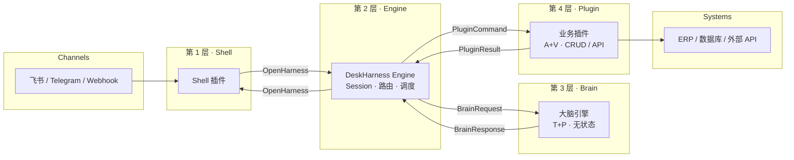

# DeskHarness ⚙️

[English](./README.md) · **简体中文**

[](LICENSE)
[](https://www.python.org/downloads/)
[](https://github.com/SynSwarm/OpenHarness)
[](CHANGELOG.md)

**开源 Thin Harness Engine** — 用清晰契约解耦 **Shell**、**Engine**、**Brain** 与 **插件**。

> **换飞书 Bot 不用改 Brain，换大模型不用改插件。**
>
> **决策在 Brain，执行在插件，证据在 V，路由在 Engine。**

---

## 我们解决什么问题

在一个 AI 应用里，谁有资格**做决策**？谁有资格**执行**？失败时的**证据链**在哪？

多数项目做着做着就耦成单体：换渠道要改 Brain，换模型要动插件，出了问题说不清是哪一层的责任。DeskHarness 用 **Integration Harness（集成编排层）** 回答上述问题 — 它不是 Agent 框架，而是 AI 应用的 **集成总线**：不造「发动机」，只规定 Shell、Brain、插件之间的标准接口与接线方式。

类比一下：

| | LangChain / CrewAI 等 | DeskHarness |
|---|----------------------|-------------|
| 核心问题 | 如何让 LLM 更好地思考与用工具？ | 如何把思考、工具、渠道干净地拼装起来？ |
| 角色 | 提供「发动机」和「传感器」 | 定义它们之间的标准接口与「电路系统」 |
| 可替换性 | 换模型/工具常要改框架代码 | 换模型改 `brain.yaml`，换渠道换 Shell 插件 |

**互补而非竞争：** 完全可以用 LangChain 实现 Brain，再接入 DeskHarness 负责编排与契约 — 既保留推理能力，又避免被单一框架绑死。

**当前状态：** **v0.1.0 发布候选** — Phase 0–3 已完成（Thin Engine 生产就绪）。见 [CHANGELOG](CHANGELOG.md)（含 [已知限制](CHANGELOG.md#known-limitations-v010)）与 [发布清单](doc/deployment/release.md)。Phase 4 下一步：飞书 Demo、文档站。

---

## 核心价值

### 架构守卫 — 用契约防止系统「裸奔」

通过 [OpenHarness](https://github.com/SynSwarm/OpenHarness) 协议与 `routes.yaml`，强制将 **大脑（决策）**、**插件（执行）**、**Shell（表现）** 彻底分离：

| 铁律 | 含义 |
|------|------|
| Brain 只做 **T+P** | 输出目标与计划；**不**操作数据库 |
| 插件只做 **A+V** | 改变世界与读取证据；**不**决定下一跳 |
| Engine 只做 **R** | 读 verification 证据做路由；**不**写业务分支 |
| Shell 只做转换 | 采集意图、渲染回复；**不**直连 Brain 或插件 |

多渠道、多插件场景下，这些约束能从根上防止系统演变成一团乱麻。完整反模式清单与 [评审 5 问](doc/architecture/architecture.md#12-评审-5-问强制) 见 [`doc/architecture/architecture.md`](./doc/architecture/architecture.md)。

### TPAVR 分形元规则 — 一致的调试视角

**T**arget · **P**lan · **A**ction · **V**erify · **R**oute 不只是一次对话（Turn）的外壳，而是贯穿插件 handler 内部、单条命令、整次回合的 **分形结构** — 无论你从哪个尺度调试，看到的逻辑骨架都是一致的。这会显著降低大型 AI 应用的认知与维护成本。详见架构文档 [§8 TPAVR](doc/architecture/architecture.md#8-tpavrr-公理叙事脊梁)。

### v0.1.0 已交付

- **OpenHarness** invoke + **webhook-generic** Shell（`POST /shells/webhook-generic/inbound`）
- **插件执行**：`local-script` · `sync-http` · `async-webhook` · `in-process` — 内置 `noop` / `echo` / `order-lookup` / `async-demo`
- **Brain 适配**：`mock` · `http` · `prompt-template`（零 LLM 规则 YAML）
- **运维可观测**：`/metrics` · Turn 审计日志 · `/debug/routes` · `/debug/dry-run` · 可选 rate limit
- **Session**：默认 SQLite，可选 Redis（`pip install deskharness[redis]`）
- **部署**：官方 Docker 镜像（`ghcr.io/synswarm/deskharness`）· `docker compose` 示例 · `deskharness plugin new` 脚手架

**Phase 4 计划：** `feishu-bot` Shell · `examples/feishu-order/` 端到端 Demo · MkDocs 文档站。

---

## 快速开始

需要 Python 3.11+。

```bash
git clone https://github.com/SynSwarm/DeskHarness.git
cd DeskHarness
pip install -e ".[dev]"

# 启动 Engine（无 config.yaml 时自动使用 config.template.yaml）
deskharness serve
```

另开终端：

```bash
# 健康检查
curl -s http://127.0.0.1:8080/openharness/health

# 最小 invoke（金样 fixture）
curl -s -X POST http://127.0.0.1:8080/openharness/invoke \
  -H 'Content-Type: application/json' \
  -d @schemas/openharness/fixtures/minimal-request.json

# 完整回合：mock Brain → noop 插件（触发词 trigger-noop）
curl -s -X POST http://127.0.0.1:8080/openharness/invoke \
  -H 'Content-Type: application/json' \
  -d '{"protocol_version":"1.0.0","request_id":"req_noop","request":{"context":{"session_id":"sess_noop","user_intent":"please trigger-noop"}}}'

# Webhook Shell
curl -s -X POST http://127.0.0.1:8080/shells/webhook-generic/inbound \
  -H 'Content-Type: application/json' \
  -d '{"text":"Hello from webhook","session_id":"sess_demo"}'
```

契约测试：

```bash
pytest tests/ -q
```

**Docker 一键启动**（在仓库根目录）：

```bash
docker compose -f examples/minimal/docker-compose.yml up --build
```

**官方镜像**（GHCR 发布 tag 后）：

```bash
docker run -d -p 8080:8080 ghcr.io/synswarm/deskharness:latest
# 或：docker compose -f examples/minimal/docker-compose.image.yml up -d
```

详见 [`doc/deployment/docker.md`](doc/deployment/docker.md)。

**脚手架新建插件：**

```bash
deskharness plugin new my-bot --type plugin
deskharness plugin new my-shell --type shell
```

可选：复制 `configs/config.template.yaml` → `configs/config.yaml` 做本地覆盖（已 `.gitignore`）。若需零 LLM 的规则型 Brain，设置 `brain.adapter: prompt-template` 与 `brain.template_file: ./configs/brain.prompt-template.yaml` — 见 [`examples/minimal/`](./examples/minimal/)。

---

## 架构

四层模型，边界严格 — 禁止跨层直连。



| 层 | 职责 | 示例 |
|----|------|------|
| **Shell** | 采集意图、渲染回复；渠道适配 | `webhook-generic`（已交付）· `feishu-bot`（Phase 4） |
| **Engine** | OpenHarness 端点、Session、路由、插件网关 | `app/` + `core/` |
| **Brain** | LLM / RAG 推理；输出 Target + Plan（T+P） | 外置 HTTP 服务（可用 LangChain 实现） |
| **Plugin** | 机械执行；Action + Verify（A+V） | `noop` · `echo` · `order-lookup` · `async-demo` |

**记法：** Brain 思考，插件执行，Engine 编排。Shell 仅通过 [OpenHarness](https://github.com/SynSwarm/OpenHarness) 与 Engine 通信。

---

## 为谁而建

| 角色 | 你能得到什么 |
|------|-------------|
| **企业架构师 / Tech Lead** | 为多项目提供统一、可治理的 AI 集成底座；反模式清单与评审 5 问防止架构腐化 |
| **高级后端开发者** | 厌倦在框架里打滚？这里有一个薄核心、边界清晰、可契约测试的编排层 |
| **开源贡献者** | 核心极薄、扩展点明确 — 开发新 Shell（Discord、Slack、飞书）或 Brain 适配器成本低 |

---

## 适用场景

| ✅ 适合 | ❌ 不适合 |
|---------|----------|
| 多渠道 Bot（飞书、Telegram、Webhook）共用同一 Brain | 拖拽式 Agent 搭建（见 Dify、扣子） |
| 换大模型供应商而不重写插件 | 一体化 RAG + 控制台平台 |
| 中小企业：单进程部署，SQLite 默认 / Redis 可选，官方 Docker，无需 K8s | 复杂多 Agent 推理图 |
| 无头集成进现有后端 | 在 Brain 层替代 LangChain |

---

## 与同类项目对比

DeskHarness **补充** Agent 框架 — 位于 **集成与契约** 层。

| | DeskHarness | LangChain / CrewAI | Dify / FastGPT | n8n |
|---|-------------|-------------------|----------------|-----|
| **核心问题** | 谁做什么、用什么契约？ | LLM 如何思考与调工具？ | 用户如何在 UI 里搭 Agent？ | 如何串联自动化？ |
| **类比** | 集成总线 / 标准接口 | 发动机与传感器 | 整车装配线 | 流水线编排 |
| **Brain / LLM** | 外置 HTTP 服务 | 内置 Chain / Agent | 内置模型路由 | 非重点 |
| **渠道** | 可插拔 Shell 插件 | 自备接入 | 内置应用 | 连接器 |
| **业务逻辑** | 插件层（A+V） | Tools / 自定义代码 | 工作流节点 | 工作流节点 |
| **Session 真源** | Engine 持有 `session_id` | 因框架而异 | 平台托管 | 按工作流 |
| **部署** | 单进程；SQLite / 可选 Redis；官方 Docker | 库 / 多样 | 托管或自建 | 自建 SaaS |
| **UI** | 无头（Headless） | 无 / 可选 | 完整控制台 | 可视化编辑器 |

Agent 框架回答 *「LLM 该怎么推理？」*  
DeskHarness 回答 *「状态谁持有、层间怎么说话、失败时证据在哪、如何降级？」*

---

## 设计哲学

1. **Shell** — 可替换渠道客户端（飞书、Telegram、Webhook）
2. **Engine** — OpenHarness 端点、Session、路由（[`app/`](./app/) + [`core/`](./core/)）
3. **Brain** — 无状态认知；结构化 T+P 输出
4. **Plugin** — CRUD、API、自动化钩子（A+V）

Engine 不思考、不执行 — 只路由并持有 Session 真源。

---

## 路线图

| 阶段 | 重点 | 状态 |
|------|------|------|
| Phase 0 | 架构、协议、仓库结构 | ✅ 完成 |
| Phase 1 | Engine MVP — invoke → Brain → 插件闭环 | ✅ 完成 |
| Phase 2 | 插件加载器、Shell API、`docker compose`、脚手架 CLI | ✅ 完成 |
| Phase 3 | 结构化日志、metrics、Redis Session、sync-http、debug、Docker GHCR | ✅ 完成 |
| Phase 4 | `feishu-order` Demo、`feishu-bot` Shell、文档站、插件 SDK | 🚧 下一步 |

详情：[`doc/roadmap/phase-plan.md`](./doc/roadmap/phase-plan.md) · 进度：[`PROGRESS.md`](./PROGRESS.md) · 变更：[`CHANGELOG.md`](./CHANGELOG.md)

---

## 文档

| 主题 | 链接 |
|------|------|
| 架构（公开真源） | [`doc/architecture/architecture.md`](./doc/architecture/architecture.md) |
| OpenHarness 协议 | [`doc/specs/openharness-protocol.md`](./doc/specs/openharness-protocol.md) · [OpenHarness 仓库](https://github.com/SynSwarm/OpenHarness) |
| 插件 TPAVR 指南 | [`doc/extension/plugin-tpavr-guide.md`](./doc/extension/plugin-tpavr-guide.md) |
| Docker 部署 | [`doc/deployment/docker.md`](./doc/deployment/docker.md) |
| GitHub About | [`doc/deployment/github-about.md`](./doc/deployment/github-about.md)（Description · Topics） |
| 发布清单 | [`doc/deployment/release.md`](./doc/deployment/release.md) |
| 变更日志 | [`CHANGELOG.md`](./CHANGELOG.md) |
| 目录结构 | [`STRUCTURE.md`](./STRUCTURE.md) |
| 文档索引 | [`doc/README.md`](./doc/README.md) |
| 示例 | [`examples/minimal/`](./examples/minimal/) · [`examples/feishu-order/`](./examples/feishu-order/) |

---

## 参与贡献

欢迎 Issue 与 PR。入门建议：

- 提交前运行 `pytest tests/ -q`
- 阅读 [`STRUCTURE.md`](./STRUCTURE.md) 了解层边界（Engine 不得包含业务逻辑）
- 插件代码仅依赖 [`pkg/`](./pkg/)
- 新插件/路由合入前对照 [评审 5 问](doc/architecture/architecture.md#12-评审-5-问强制)

---

## 许可证

Apache License 2.0。见 [LICENSE](LICENSE).
